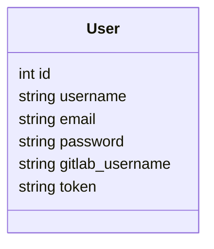
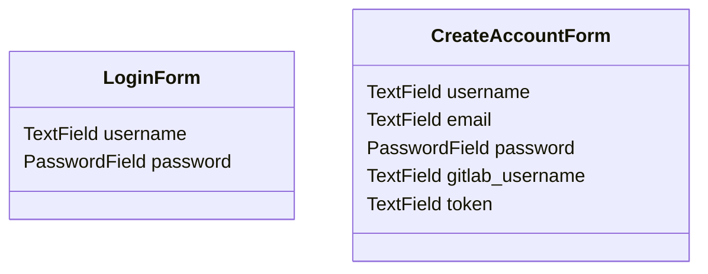

# Developer Guide

## Overview

This app is used to show significant metrics on how a team is performing during their software release schedule. GitLab is a web application that is used as a software development lifecycle and version control tool. It allows software teams to store code, write documentation, and track issues in a continuous integration environment.

This Python application is written utilizing Flask as the web framework and ChartsJS for data visualization.

The primary users of this application are people in work environments, such as scrum masters and managers, who need to keep track of how individuals and teams are performing and meeting their deadlines. Secondary stakeholders could be general FOSS developers who maintain repositories on GitLab. Often, teams need to generate data on how they are performing to provide stakeholders visual feedback on how they are managing their development. This would help keep users aware of the current status of their software development team. Managers would be able to project future software development by utilizing the current metrics

---

## Technical Specs

### Database

This application utilizes SQLAlchemy to store information on the User. Refer to the User class in [../app/base/models.py](../app/base/models.py).

#### Functions

The database is configured and built in the function `configure_database()`. If not already created, the table will be created and the configuration will be saved in `database.db`.

To destroy the database session, you can use the function `shutdown_request()`.

### Authentication

This application utilizes FlaskForm to have the user input data in an organized way. Refer to the Forms module in [../app/base/forms.py](../app/base/forms.py).

#### Forms

#### Login

#### Registration

### Style Updates

---

## Known Issues

- There is a bit of a lag when initializing the page as its calling and aggregating multiple requests.
- The query for monthly issues could be reworked in a better way so the same request isn't made 12 times.

## Future Work

### Message Brokering

Instead of single HTTP requests, the application should utilize a message broker (ArtemisMQ) to listen for updates so the dashboard is more dynamic.

### Optimization

Some of the HTTP requests need to be updated to be more optimized to cut back on some of the delay when the page is loaded. Consider caching some of the data so it doesn't have to be re-loaded every time.

### Configuration

Update to not store any credentials or have any placeholder account information. Maybe integrate single sign on.

### Security

Update to work on the corporate proxy and have an extra layer of security while connecting to the GitLab server.

## Author

- **Maeve Kenny** - maevek@iastate.edu
