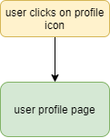

# Developer Guide

## Overview

This app is used to show significant metrics on how a team is performing during their software release schedule. GitLab is a web application that is used as a software development lifecycle and version control tool. It allows software teams to store code, write documentation, and track issues in a continuous integration environment.

This Python application is written utilizing Flask as the web framework and ChartsJS for data visualization.

The primary users of this application are people in work environments, such as scrum masters and managers, who need to keep track of how individuals and teams are performing and meeting their deadlines. Secondary stakeholders could be general FOSS developers who maintain repositories on GitLab. Often, teams need to generate data on how they are performing to provide stakeholders visual feedback on how they are managing their development. This would help keep users aware of the current status of their software development team. Managers would be able to project future software development by utilizing the current metrics

---

## Technical Specs

### Database

This application utilizes SQLAlchemy to store information on the User. Refer to the User class in [app/base/models.py](../app/base/models.py). For easy development, there is a user automatically created with the credentials _test_:_password_.

#### Functions

The database is configured and built in the function `configure_database()`. If not already created, the table will be created and the configuration will be saved in `database.db`.

To destroy the database session, you can use the function `shutdown_request()`.

### Authentication

This application utilizes FlaskForm to have the user input data in an organized way. Refer to the Forms module in [app/base/forms.py](../app/base/forms.py).

#### Forms

There are two forms in the system - login & registration.

#### Login

The workflow diagram of user login is below.

When a user is at the login page and they input their credentials, the username must be checked if it exists. If the username doesn't exist, they create an account instead.

If the username does exist, the password is decoded and validated to check for accuracy.

- If the password is valid, display the dashboard page.
- If the password is invalid, display an error.

#### Registration

The workflow diagram of user registration is below.

If a user does not have an account created, they must register one to get to the dashboard.

If they input invalid GitLab information, an error is displayed.

If they input valid GitLab information, the username for the system is verified against the database. If the username exists, an error is displayed.

If the username does not exist, the account is created and stored in the database. The user receives confirmation on the display.

### Dashboard

When the dashboard page is displayed, request calls found in [app/base/requests.py](../../app/base/requests.py) are sent to the GitLab API to retrieve data. Once data is received and aggregated, it is rendered on the display.

#### Performance Graph

The graph made in ChartJS visualizes the amount of issues opened / closed in a particular time frame. By default, the week time frame is displayed.

##### Week View

When the user selects the button within the chart to display the week, the data is re-requested with the time frame of the past 7 days. The graph automatically updates.

##### Year-2020 View

When the user selects the button within the chart to display the week, the data is re-requested with the time frame of the past months of 2020. The graph automatically updates.

### User Profile

Once the user is logged into the dashboard, they can navigate to their account unique to the system. This is accessed by selecting the profile picture in the navigation bar.

### Style

The project style framework is from [Bootstrap Darkly](https://getbootstrap.com/) with custom functions & scss.

---

## Known Issues

- There is a bit of a lag when initializing the page as its calling and aggregating multiple requests.
- The query for monthly issues could be reworked in a better way so the same request isn't made 12 times.

## Future Work

### Message Brokering

Instead of single HTTP requests, the application should utilize a message broker (ArtemisMQ) to listen for updates so the dashboard is more dynamic.

### Optimization

Some of the HTTP requests need to be updated to be more optimized to cut back on some of the delay when the page is loaded. Consider caching some of the data so it doesn't have to be re-loaded every time.

### Configuration

Update to not store any credentials or have any placeholder account information. Maybe integrate single sign on.

### Security

Update to work on the corporate proxy and have an extra layer of security while connecting to the GitLab server.

## Author

- **Maeve Kenny** - maevek@iastate.edu
